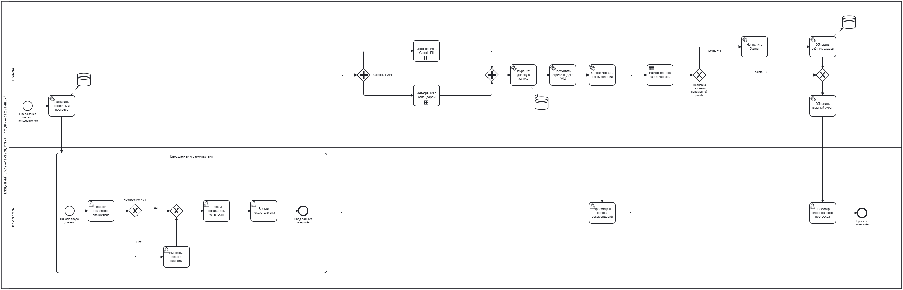
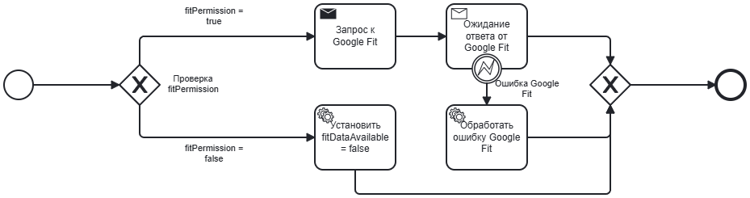
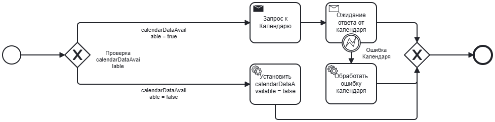

## BPMN-диаграмма «Ежедневный цикл учёта самочувствия и получение рекомендаций»

Описывает полный цикл взаимодействия пользователя с системой StressGuard: от открытия приложения до получения персонализированных рекомендаций и начисления мотивационных баллов. Процесс включает ручной ввод настроения, усталости и параметров сна, параллельные запросы к внешним API (Google Fit, календарь), ML-расчёт стресс-индекса, генерацию рекомендаций, их оценку пользователем и обновление счётчика входов. В процессе участвуют два основных пула: Пользователь (выполняет пользовательские задачи) и Система (автоматические задачи, включая DMN-вызов). Предусмотрена обработка ошибок при недоступности API и ветвление по результатам DMN.

BPMN-диаграмма реализована в Camunda 8 Modeler:

[stress-guard-final.svg](https://buildin.ai/preview/8213aaa5-24c5-4517-b342-fc1554e424eb)

### Подпроцесс «Интеграция с Google Fit»

[stress-guard-final (1).svg](https://buildin.ai/preview/d2359f2e-3b71-4f83-859f-21a56a3dbf06)

### Подпроцесс «Интеграция с Календарём»

[stress-guard-final (2).svg](https://buildin.ai/preview/40a7d9f8-51ba-4593-b810-90e31a748c11)