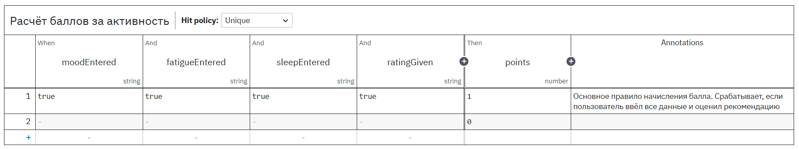

## Описание

DMN-таблица принимает решение о начислении балла за завершённый цикл. Входные данные: флаги `moodEntered`, `fatigueEntered`, `sleepEntered` (все три должны быть `true`) и `ratingGiven` (`true`, если пользователь оценил рекомендации). Правило: если все четыре условия истинны, выход `points = 1`, иначе `points = 0`. Используется hit policy **Unique**. Таблица привязана к Business Rule Task в BPMN.

## Необходимость использования

**Цель:** Вовлечение и стимулирование пользователя активно пользоваться приложением.

**Бизнес-правила:**
- Студенты вузов за **50 входов** в приложение в течение 3 месяцев могут получить в качестве бонуса — автомат по 1 предмету на выбор.
- Сотрудники организаций за **80 входов** в приложение в течение 5 месяцев могут получить в качестве бонуса — плюс один день к отпуску.

**Роль DMN:** DMN контролирует и отсекает тех пользователей, которые хотели бы пользоваться приложением не по его основному назначению (контролировать и управлять уровнем стресса себе во благо), а только заходить в приложение с целью получить заветный бонус даром.

## Таблица решений

| moodEntered | fatigueEntered | sleepEntered | ratingGiven | points |
|-------------|----------------|--------------|-------------|--------|
| true | true | true | true | 1 |
| – | – | – | – | 0 |

(«–» означает «любое значение»)

## Файл DMN



## Код XML

```xml
<?xml version="1.0" encoding="UTF-8"?>
<definitions xmlns="https://www.omg.org/spec/DMN/20191111/MODEL/&quot;
             xmlns:dmdni="https://www.omg.org/spec/DMN/20191111/DMNDI/&quot;
             xmlns:dc="http://www.omg.org/spec/DMN/20180521/DC/&quot;
             xmlns:modeler="http://camunda.org/schema/modeler/1.0&quot;
             id="Definitions_0k4hase" name="calculatePoints"
             namespace="http://camunda.org/schema/1.0/dmn&quot;
             exporter="Camunda Modeler" exporterVersion="5.45.0"
             modeler:executionPlatform="Camunda Cloud" modeler:executionPlatformVersion="8.8.0">
  <decision id="calculatePoints" name="Raschet ballov za aktivnost">
    <decisionTable id="DecisionTable_0ziumuc">
      <input id="Input_1" label="moodEntered">
        <inputExpression id="InputExpression_1" typeRef="string">
          <text>moodEntered</text>
        </inputExpression>
      </input>
      <input id="InputClause_0bxrney" label="fatigueEntered">
        <inputExpression id="LiteralExpression_0nhw5g8" typeRef="string">
          <text>fatigueEntered</text>
        </inputExpression>
      </input>
      <input id="InputClause_0hx5gj4" label="sleepEntered">
        <inputExpression id="LiteralExpression_04ivvhd" typeRef="string">
          <text>sleepEntered</text>
        </inputExpression>
      </input>
      <input id="InputClause_1tucxrd" label="ratingGiven">
        <inputExpression id="LiteralExpression_1hh4qrr" typeRef="string">
          <text>ratingGiven</text>
        </inputExpression>
      </input>
      <output id="Output_1" label="points" name="points" typeRef="number"/>
      <rule id="DecisionRule_1sz2s2v">
        <description>Основное правило начисления балла. Срабатывает, если пользователь ввёл все данные и оценил рекомендацию</description>
        <inputEntry id="UnaryTests_1f3x8yw">
          <text>true</text>
        </inputEntry>
        <inputEntry id="UnaryTests_01uzv3n">
          <text>true</text>
        </inputEntry>
        <inputEntry id="UnaryTests_0cadgbs">
          <text>true</text>
        </inputEntry>
        <inputEntry id="UnaryTests_1oand6h">
          <text>true</text>
        </inputEntry>
        <outputEntry id="LiteralExpression_03aiuwg">
          <text>1</text>
        </outputEntry>
      </rule>
      <rule id="DecisionRule_08va94m">
        <inputEntry id="UnaryTests_0muoxgo">
          <text></text>
        </inputEntry>
        <inputEntry id="UnaryTests_0vqm86p">
          <text></text>
          </inputEntry>
        <inputEntry id="UnaryTests_0o9mv1o">
          <text></text>
        </inputEntry>
        <inputEntry id="UnaryTests_1qvfl8l">
          <text></text>
        </inputEntry>
        <outputEntry id="LiteralExpression_0jpl5b4">
          <text>0</text>
        </outputEntry>
      </rule>
    </decisionTable>
  </decision>
  <dmdni:DMNDI>
    <dmdni:DMNDiagram>
      <dmdni:DMNShape id="Decision_0nz3p4w_di" dmnElementRef="calculatePoints">
        <dc:Bounds height="80" width="180" x="160" y="100"/>
      </dmdni:DMNShape>
    </dmdni:DMNDiagram>
  </dmdni:DMNDI>
</definitions>