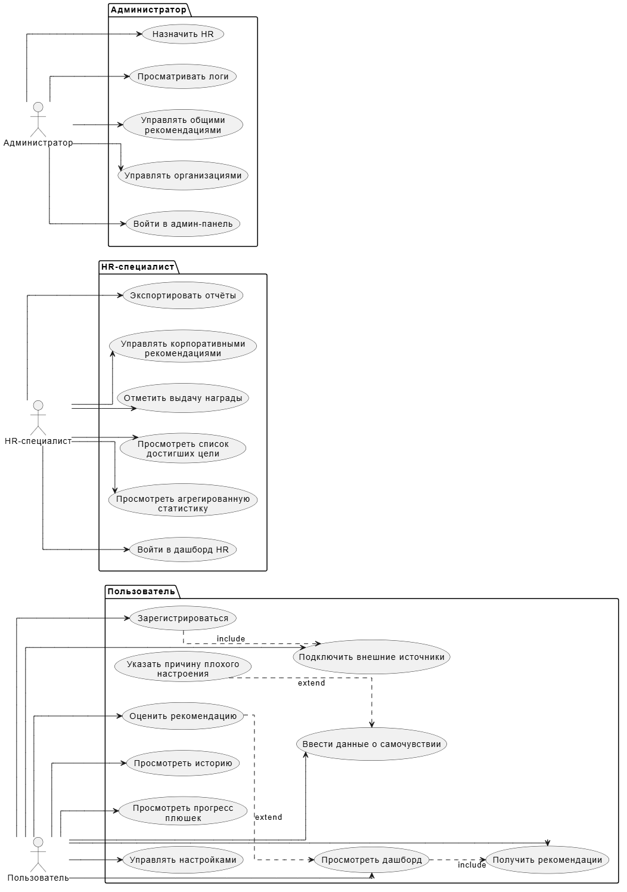

## Use Case-диаграмма StressGuard

Диаграмма вариантов использования для системы StressGuard отображает три ключевые роли: **Пользователь** (сотрудник/студент), **HR-специалист** и **Администратор**. Каждая роль имеет свой набор функциональных возможностей, представленных в виде use case, сгруппированных в пакеты.



[diagram-uml-use-case.svg](https://buildin.ai/preview/3ba111d1-bfe4-4c50-ab07-f9567a43bcdf)

### Пояснения

- Акторы (Пользователь, HR-специалист, Администратор) расположены в центре верхней части диаграммы.
- Для каждого актора создан отдельный пакет (package), содержащий его варианты использования. Пакеты визуально группируют функции соответствующей роли.
- Стрелки от акторов к вариантам использования проведены строго вертикально (`-down->`), что обеспечивает их прямолинейность.
- Внутри пакета «Пользователь» показаны отношения **include** (обязательное включение) и **extend** (расширение по условию) между отдельными вариантами использования. Они также изображены вертикальными пунктирными линиями.

### Интерпретация

- **Пользователь** выполняет все действия, связанные с мобильным приложением: регистрацию, подключение источников, ввод данных, просмотр дашборда, получение и оценку рекомендаций, просмотр истории и прогресса, управление настройками.
- **HR-специалист** через веб-дашборд просматривает агрегированную статистику, список достигших цели пользователей, отмечает выдачу наград, экспортирует отчёты и добавляет корпоративные рекомендации.
- **Администратор** управляет организациями, базой общих рекомендаций, назначает HR и отслеживает системные логи.

### Примечание о рекомендациях

В проекте StressGuard администратор управляет общей базой рекомендаций. Это означает, что администратор отвечает за наполнение системы готовыми текстами советов, их категориями и правилами показа. Например, администратор добавляет новую рекомендацию: *«Сделайте короткую прогулку на свежем воздухе»* с тегом *«движение»* и указывает, что её стоит показывать при низкой физической активности.

ML-модуль (возможно, в сочетании с rule-движком) выбирает из существующей базы наиболее подходящие под конкретную ситуацию пользователя. Модель может учитывать множество факторов (текущий стресс-индекс, данные календаря, качество сна, историю предыдущих рекомендаций и их оценок), чтобы ранжировать советы и предложить самые релевантные.

### Код диаграммы в PlantUML

```plantuml
@startuml

' Настройки
skinparam responseMessageReturnArrow true
skinparam ArrowColor black
skinparam ActorBorderColor black

' Участники
actor "Пользователь" as User
participant "Мобильное приложение" as Mobile
participant "Бэкенд" as Backend
participant "Google Fit API" as Fit
participant "Календарь API" as Cal
participant "ML-сервис" as ML
participant "DMN движок" as DMN
database "База данных" as DB

' Сценарий
User -> Mobile: Открывает приложение
activate Mobile

Mobile -> Backend: GET /profile
activate Backend

Backend -> DB: Запрос профиля
activate DB
DB --> Backend: Профиль (userType, currentEntries, etc.)
deactivate DB

Backend --> Mobile: Данные профиля
deactivate Backend

Mobile -> User: Отображает экран ввода
User -> Mobile: Вводит настроение, усталость, сон
Mobile -> Backend: POST /daily-entry (данные)
activate Backend

' Параллельные запросы к внешним API
par
  ' Ветка Google Fit
  Backend -> Fit: GET /fitness (асинхронно)
  activate Fit
  alt fitPermission = true
    Fit --> Backend: Данные (пульс, шаги, сон)
    Backend -> Backend: Установить fitDataAvailable = true
  else fitPermission = false or ошибка
    Fit --> Backend: Ошибка/недоступно
    Backend -> Backend: Установить fitDataAvailable = false
  end
  deactivate Fit

  ' Ветка Календарь
  Backend -> Cal: GET /calendar (асинхронно)
  activate Cal
  alt calendarPermission = true
    Cal --> Backend: События
    Backend -> Backend: Установить calendarDataAvailable = true
  else calendarPermission = false or ошибка
    Cal --> Backend: Ошибка/недоступно
    Backend -> Backend:
    Установить calendarDataAvailable = false
  end
  deactivate Cal
end

' Сохранение дневной записи
Backend -> DB: INSERT daily_entry (все данные)
activate DB
DB --> Backend: OK
deactivate DB

' Вызов ML
Backend -> ML: POST /stress-index (данные)
activate ML
ML --> Backend: stressIndex
deactivate ML

' Генерация рекомендаций (rule-based)
Backend -> Backend: Сформировать рекомендации
Backend --> Mobile: Рекомендации + прогресс
deactivate Backend

Mobile -> User: Показывает рекомендации и прогресс
User -> Mobile: Оценивает рекомендации (лайк/дизлайк)
Mobile -> Backend: POST /feedback (оценка)
activate Backend

' DMN для начисления баллов
Backend -> DMN: evaluate (moodEntered, fatigueEntered, sleepEntered, ratingGiven)
activate DMN
DMN --> Backend: points (0 или 1)
deactivate DMN

alt points == 1
  Backend -> DB: UPDATE points (увеличить)
  activate DB
  DB --> Backend: OK
  deactivate DB
else points == 0
  ' ничего не делаем
end

' Обновление счётчика входов
Backend -> DB: UPDATE currentEntries (увеличить)
activate DB
DB --> Backend: OK
deactivate DB

' Проверка достижения цели
Backend -> Backend: if currentEntries >= goalEntries then goalAchieved = true
Backend --> Mobile: Обновлённый прогресс
deactivate Backend

Mobile -> User: Отображает финальное сообщение с прогрессом

@enduml