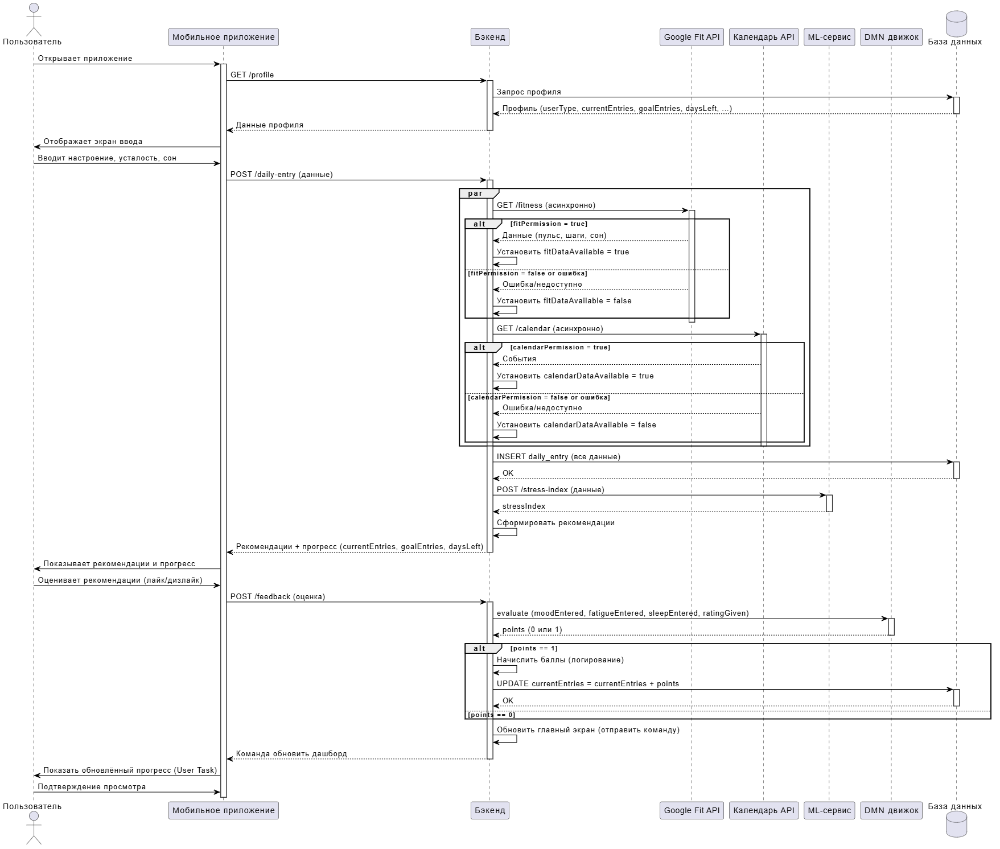

## Sequence-диаграмма StressGuard

Диаграмма отображает основной процесс **«Ежедневный ввод данных и получение рекомендаций»**. Наглядно демонстрирует взаимодействие между пользователем, фронтендом (мобильное приложение), бэкендом, внешними API (Google Fit, календарь), ML-модулем и базой данных.



[sequence-diagram.svg](https://buildin.ai/preview/08455299-eccb-4c6a-9f1a-dc99384079f1)

### Пояснения к диаграмме

- **Актор**: Пользователь, инициирующий процесс.
- **Участники**: Мобильное приложение, Бэкенд, Google Fit API, Календарь API, ML-сервис, DMN-движок, База данных.
- **Сценарий** охватывает полный цикл: от открытия приложения до финального отображения прогресса.
- **Параллельный блок `par`** показывает одновременные запросы к внешним API.
- **Альтернативы `alt`** внутри каждой ветки моделируют успешный и ошибочный исходы (включая отсутствие разрешения).
- **DMN-вызов** выделен отдельным участником процесса, что способствует повышению ясности, управляемости и эффективности бизнес-процесса.
- **Условие `alt` после DMN** определяет, начислен ли балл (`points == 1`).
  - При `points == 1` выполняется **логирование начисления баллов** (системная задача «Начислить баллы») и **обновление счётчика входов** (`currentEntries = currentEntries + points`).
  - При `points == 0` счётчик не изменяется.
- После обновления счётчика **системная задача «Обновить главный экран»** отправляет команду мобильному приложению перерисовать дашборд с новыми данными.
- **Пользовательская задача «Просмотр обновлённого прогресса»** позволяет пользователю увидеть итоговое сообщение (с поздравлением при достижении цели) и подтвердить завершение цикла.
- Все ответы от участников показаны пунктирными стрелками (`-->`). Синхронные вызовы — сплошными (`->`). Асинхронные запросы к API также показаны сплошными (для упрощения, фактически они асинхронны).

### Код диаграммы в PlantUML

```plantuml
@startuml

skinparam responseMessageReturnArrow true
skinparam ArrowColor black
skinparam ActorBorderColor black

actor "Пользователь" as User
participant "Мобильное приложение" as Mobile
participant "Бэкенд" as Backend
participant "Google Fit API" as Fit
participant "Календарь API" as Cal
participant "ML-сервис" as ML
participant "DMN движок" as DMN
database "База данных" as DB

' Сценарий
User -> Mobile: Открывает приложение
activate Mobile

Mobile -> Backend: GET /profile
activate Backend

Backend -> DB: Запрос профиля
activate DB
DB --> Backend: Профиль (userType, currentEntries, goalEntries, daysLeft, ...)
deactivate DB

Backend --> Mobile: Данные профиля
deactivate Backend

Mobile -> User: Отображает экран ввода
User -> Mobile: Вводит настроение, усталость, сон
Mobile -> Backend: POST /daily-entry (данные)
activate Backend

' Параллельные запросы к внешним API
par
  ' Ветка Google Fit
  Backend -> Fit: GET /fitness (асинхронно)
  activate Fit
  alt fitPermission = true
    Fit --> Backend: Данные (пульс, шаги, сон)
    Backend -> Backend: Установить fitDataAvailable = true
  else fitPermission = false or ошибка
    Fit --> Backend: Ошибка/недоступно
    Backend -> Backend: Установить fitDataAvailable = false
  end
  deactivate Fit

  ' Ветка Календарь
  Backend -> Cal: GET /calendar (асинхронно)
  activate Cal
  alt calendarPermission = true
    Cal --> Backend: События
    Backend -> Backend: Установить calendarDataAvailable = true
  else calendarPermission = false or ошибка
    Cal --> Backend: Ошибка/недоступно
    Backend -> Backend: Установить calendarDataAvailable = false
  end
  deactivate Cal
end

' Сохранение дневной записи
Backend -> DB: INSERT daily_entry (все данные)
activate DB
DB --> Backend: OK
deactivate DB

' Вызов ML
Backend -> ML: POST /stress-index (данные)
activate ML
ML --> Backend: stressIndex
deactivate
ML

' Генерация рекомендаций (rule-based)
Backend -> Backend: Сформировать рекомендации
Backend --> Mobile: Рекомендации + прогресс (currentEntries, goalEntries, daysLeft)
deactivate Backend

Mobile -> User: Показывает рекомендации и прогресс
User -> Mobile: Оценивает рекомендации (лайк/дизлайк)
Mobile -> Backend: POST /feedback (оценка)
activate Backend

' DMN для начисления баллов
Backend -> DMN: evaluate (moodEntered, fatigueEntered, sleepEntered, ratingGiven)
activate DMN
DMN --> Backend: points (0 или 1)
deactivate DMN

alt points == 1
  Backend -> Backend: Начислить баллы (логирование)
  Backend -> DB: UPDATE currentEntries = currentEntries + points
  activate DB
  DB --> Backend: OK
  deactivate DB
else points == 0
  ' ничего не делаем
end

' Системная задача: обновить главный экран
Backend -> Backend: Обновить главный экран (отправить команду)
Backend --> Mobile: Команда обновить дашборд
deactivate Backend

' Пользовательская задача: просмотр обновлённого прогресса
Mobile -> User: Показать обновлённый прогресс (User Task)
User -> Mobile: Подтверждение просмотра

@enduml