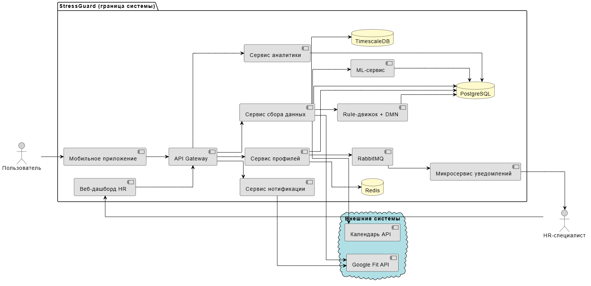
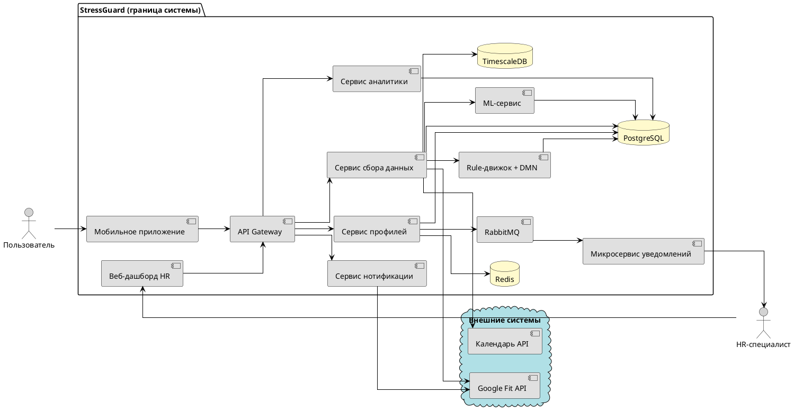

## Архитектура приложения StressGuard

Система StressGuard построена по **клиент-серверной архитектуре** с выделением микросервисных компонентов для ML и DMN, а также интеграции с внешними API. Ниже представлено описание и наглядная схема.

### 1. Компоненты системы

#### Клиентская часть (Frontend)

- **Мобильное приложение (iOS/Android)** – разработано на React Native.  
  **Функции:**
  - регистрация и авторизация;
  - ввод субъективных данных (настроение, усталость, сон);
  - отображение дашборда (стресс-индекс, график, рекомендации);
  - оценка рекомендаций (лайк/дизлайк);
  - просмотр прогресса (текущие входы / цель);
  - управление настройками (подключение календаря, Google Fit, приватность).

- **Веб-дашборд для HR / деканата** – SPA на React.  
  **Функции:**
  - аутентификация;
  - просмотр агрегированной статистики (средний стресс по отделам/группам, динамика);
  - список пользователей, достигших цели по количеству входов;
  - отметка о выдаче награды;
  - экспорт отчётов (PDF/Excel);
  - управление корпоративными рекомендациями (опционально).

#### Серверная часть (Backend)

- **API Gateway** (Python FastAPI) – единая точка входа для всех клиентов. Обрабатывает аутентификацию (JWT), маршрутизацию запросов к внутренним сервисам.
- **Сервис пользователей и профилей** – управление аккаунтами, настройками, хранение профиля (userType, currentEntries, goalEntries, daysLeft, разрешения на интеграции).
- **Сервис сбора данных** – агрегирует данные от мобильного приложения (субъективные) и из внешних API (Google Fit, календарь). Нормализует и сохраняет в БД.
- **ML-сервис** – на Python (scikit-learn, pandas). Получает данные за день, вычисляет стресс-индекс (0–100). Модель обучается офлайн, инференс онлайн.
- **Rule-движок + DMN-сервис** – генерирует персонализированные рекомендации на основе стресс-индекса и правил. DMN-таблица «Расчёт баллов за активность» выполняется движком Camunda 8 (встроенный DMN).
- **Сервис нотификации** – отправляет push-уведомления через FCM/APNs.
- **Сервис аналитики для HR** – формирует агрегированные отчёты (без привязки к личности) по запросу веб-дашборда.

#### Внешние системы (интеграции)

- **Google Fit API** / **Apple HealthKit** – предоставляют данные о пульсе, шагах, сне, активности.
- **Google Calendar API** / **Microsoft Graph** – предоставляют события календаря (встречи, дедлайны).

#### Хранилища данных (Data Layer)

- **Реляционная БД (PostgreSQL)** – хранит профили пользователей, настройки и разрешения, историю дневных записей (DailyEntry), счётчики прогресса (currentEntries), список организаций, HR-администраторов.
- **TimescaleDB (расширение PostgreSQL)** – для эффективного хранения временных рядов (метрики пульса, шагов, сна, стресс-индекса за каждый день).
- **Кэш (Redis)** – для сессий, часто запрашиваемых данных (например, список рекомендаций).

### 2. Взаимодействие компонентов (потоки данных)

1. **Пользователь** открывает мобильное приложение → отправляет запрос на **API Gateway** → **Сервис профилей** загружает данные из БД (currentEntries, goalEntries и т.д.).
2. Пользователь вводит настроение, усталость, сон → данные отправляются в **Сервис сбора данных**.
3. **Сервис сбора данных** параллельно запрашивает:
   - данные из **Google Fit API** (через адаптер);
   - события из **Календаря API**.
   Результаты (успех/ошибка) фиксируются.
4. Все данные сохраняются в **PostgreSQL** (дневная запись) и в **TimescaleDB** (временные метрики).
5. **ML-сервис** вызывается для расчёта стресс-индекса → результат возвращается в бэкенд.
6. **Rule-движок** генерирует рекомендации на основе стресс-индекса и правил (например, если стресс высокий → совет по дыханию).
7. Рекомендации отправляются в мобильное приложение, пользователь видит их и может оценить (лайк/дизлайк). Оценка передаётся в бэкенд.
8. **DMN-сервис** (встроенный в Camunda) получает флаги `moodEntered`, `fatigueEntered`, `sleepEntered`, `ratingGiven` и вычисляет `points` (0 или 1).
9. В зависимости от `points`:
   - Если `points == 1`, вызывается **Сервис начисления баллов** (обновляет `currentEntries` в БД и, опционально, накопительные баллы).
   - Если `points == 0`, счётчик не увеличивается.
10. Обновлённый прогресс отправляется пользователю, отображается финальное сообщение.
11. **HR-дашборд** через **API Gateway** запрашивает агрегированную статистику → **Сервис аналитики** читает обезличенные данные из БД и возвращает.

### 3. Диаграмма архитектуры (текстовое представление)

```text
[Мобильное приложение] <-> [API Gateway] <-> [Сервис профилей] <-> [PostgreSQL/TimescaleDB]
       |                        |
       |                        +-> [Сервис сбора данных] <-> [Google Fit API]
       |                        |                           [Календарь API]
       |                        +-> [ML-сервис]
       |                        +-> [Rule-движок + DMN]
       |                        +-> [Сервис нотификации] -> FCM/APNs
       |
       +-> [Веб-дашборд HR] <--> [Сервис аналитики] <--> [PostgreSQL]
```

### 4. Ключевые особенности архитектуры

- **Асинхронность** – запросы к внешним API выполняются параллельно (см. BPMN).
- **Масштабируемость** – горизонтальное масштабирование бэкенд-сервисов через контейнеризацию (Docker, Kubernetes).
- **Безопасность** – все данные передаются по TLS 1.3; пароли хранятся в виде bcrypt-хешей; персональные данные шифруются в БД.
- **Разделение ответственности** – чёткое разделение на сервисы (профили, сбор данных, ML, DMN, аналитика).
- **Интеграция с Camunda 8** – BPMN-процесс оркестрирует основной поток, DMN-таблица принимает решение о начислении баллов.

### 5. Соответствие нефункциональным требованиям

- **Производительность** – ML-расчёт и DMN выполняются в фоне, не блокируя пользовательский интерфейс.
- **Надёжность** – резервное копирование БД ежедневно; обработка ошибок внешних API (таймауты, повторные попытки).
- **Совместимость** – мобильное приложение поддерживает iOS 14+ и Android 10+; веб-дашборд – современные браузеры.
- **Масштабируемость** – рассчитана на рост до 100 000 активных пользователей.



[архитектура stress guard.svg](https://buildin.ai/preview/0544cc9f-ffa5-4c86-98d9-95ac95d2f828)

### Код диаграммы в PlantUML:




[архитектура.svg](https://buildin.ai/preview/0dbbbe66-0dae-4710-8e53-f5e027ade42b)

### Код диаграммы в PlantUML:

```plantuml
@startuml

!include <C4/C4_Container>

!include <C4/C4_Context>

 

LAYOUT_TOP_DOWN()

LAYOUT_WITH_LEGEND()

 

Person(user, "Пользователь", "Сотрудник или студент")

Person(hr, "HR-специалист / Деканат", "Представитель организации/вуза")

 

System_Boundary(stressguard, "StressGuard") {

Container(mobile, "Мобильное приложение", "Flutter/React Native", "Ввод самочувствия, дашборд, оценка рекомендаций, прогресс")

Container(web, "Веб-дашборд HR", "React/Vue.js", "Агрегированная статистика, выдача наград, экспорт отчётов")

Container(gateway, "API Gateway", "Node.js / FastAPI", "Аутентификация, маршрутизация")

Container(profile, "Сервис профилей", "Python/Java", "Управление пользователями, настройками, прогрессом")

Container(data, "Сервис сбора данных", "Python/Java", "Агрегация субъективных и объективных данных")

Container(ml, "ML-сервис", "Python (scikit-learn)", "Расчёт стресс-индекса")

Container(rule, "Rule-движок + DMN", "Camunda 8", "Генерация рекомендаций, DMN-решение")

Container(notify, "Сервис нотификации", "Python/Java", "Push-уведомления через FCM/APNs")

Container(analytics, "Сервис аналитики", "Python/Java", "Агрегированные отчёты для HR")

ContainerDb(pg, "PostgreSQL", "Реляционная БД", "Профили, настройки, дневные записи, организации")

ContainerDb(ts, "TimescaleDB", "Временная БД", "Метрики пульса, сна, стресс-индекса")

ContainerDb(redis, "Redis", "Кэш", "Сессии, часто запрашиваемые данные")

' Новые компоненты для асинхронного взаимодействия

Container(mq, "RabbitMQ", "Брокер сообщений", "Очередь событий достижения цели")

Container(notifier, "Микросервис уведомлений", "Python/Java", "Потребление событий, отправка уведомлений HR")

}

 

System_Ext(fit, "Google Fit API", "Данные пульса, шагов, сна")

System_Ext(cal, "Календарь API", "Google/Outlook календарь")

 

Rel(user, mobile, "Использует", "HTTPS")

Rel(hr, web, "Использует", "HTTPS")

Rel(mobile, gateway, "API calls", "JSON/HTTPS")

Rel(web, gateway, "API calls", "JSON/HTTPS")

 

Rel(gateway, profile, "Запросы", "gRPC/REST")

Rel(gateway, data, "Запросы", "gRPC/REST")

Rel(gateway, analytics, "Запросы", "gRPC/REST")

 

Rel(profile, pg, "Чтение/запись", "SQL")

Rel(profile, redis, "Кэширование", "binary")

Rel(data, pg, "Сохранить дневную запись", "SQL")

Rel(data, ts, "Сохранить временные метрики", "SQL")

Rel(data, fit, "Запрос данных", "HTTPS")

Rel(data, cal, "Запрос событий", "HTTPS")

Rel(data, ml, "Вызов ML", "REST")

Rel(ml, pg, "Сохранить stressIndex", "SQL")

Rel(data, rule, "Вызов правил + DMN", "REST")

Rel(rule, pg, "Чтение рекомендаций", "SQL")

Rel(notify, fit, "Отправка push", "FCM/APNs")

Rel(gateway, notify, "Вызов", "REST")

Rel(analytics, pg, "Агрегированные запросы", "SQL")

 

' Асинхронное взаимодействие

Rel(profile, mq, "Публикация события о достижении цели", "AMQP")

Rel(mq, notifier, "Подписка на события", "AMQP")

Rel(notifier, hr, "Отправка email уведомления", "SMTP/HTTP")

 

@enduml
