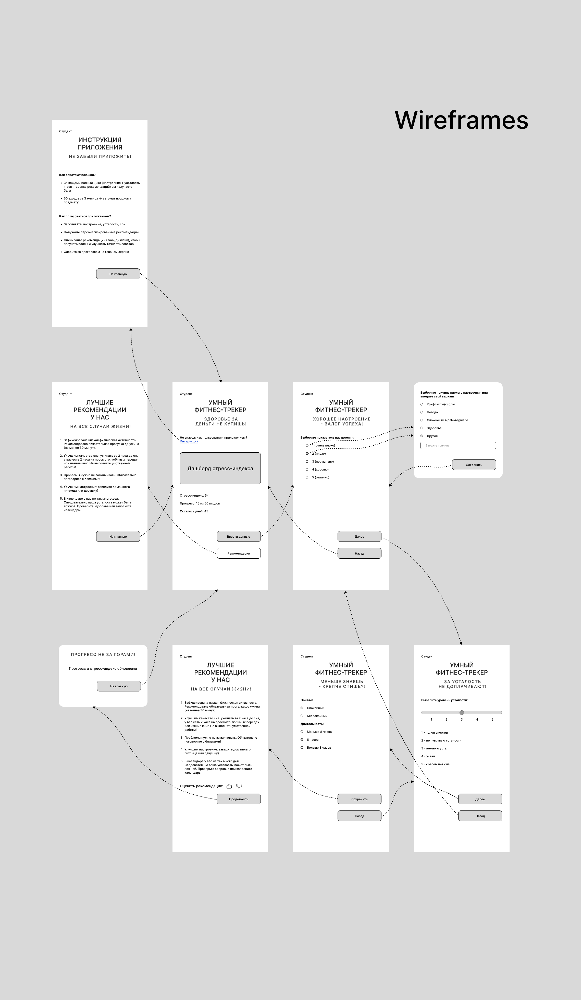

## Низкодетализированные макеты экранов системы (wireframes)

[wireframes_stress guard.svg](https://buildin.ai/preview/38e8fb91-c39f-4a56-b63d-8eb33c31d86f)

**Figma:**  
[https://www.figma.com/design/Sadh3IH3CAfS6BATqUL8Iu/%D0%A3%D0%BC%D0%BD%D1%8B%D0%B9-%D1%84%D0%B8%D1%82%D0%BD%D0%B5%D1%81-%D1%82%D1%80%D0%B5%D0%BA%D0%B5%D1%80?node-id=0-1&p=f&t=6l8j9DqHbmGJeaZL-0](https://www.figma.com/design/Sadh3IH3CAfS6BATqUL8Iu/%D0%A3%D0%BC%D0%BD%D1%8B%D0%B9-%D1%84%D0%B8%D1%82%D0%BD%D0%B5%D1%81-%D1%82%D1%80%D0%B5%D0%BA%D0%B5%D1%80?node-id=0-1&p=f&t=6l8j9DqHbmGJeaZL-0)

---

## Таблица навигации (Routing Map)

| From (Экран) / Имя для навигации | Trigger (Действие пользователя) | To (Экран / Компонент) | Тип перехода | Условия / Комментарий |
|---|---|---|---|---|
| **Экран 3: Главный экран** / `main` | Нажатие "Ввести данные" | Экран 4: Настроение | Push | Кнопка активна только если сегодня ещё не было отправлено `POST /daily-entry` (фронт блокирует после успешной отправки). |
| **Экран 3: Главный экран** / `main` | Нажатие "Инструкция" | Экран 1: Инструкция | Push | Всегда доступно. |
| **Экран 3: Главный экран** / `main` | Нажатие "Рекомендации" | Экран 2: Рекомендации | Push | Доступно, если данные за сегодня уже введены (есть кэш рекомендаций). Показывается без кнопок оценки. |
| **Экран 1: Инструкция** / `help` | Нажатие "На главную" | Экран 3: Главный экран | Pop | Возврат без сохранения. |
| **Экран 4: Настроение** / `mood` | Нажатие "Далее" | Экран 6: Усталость | Push | Переход происходит только если выбрано значение (1-5). При выборе 1 или 2 пользователь должен указать причину (модальное окно), но это не влияет на переход. |
| **Экран 4: Настроение** / `mood` | Нажатие "Назад" | Экран 3: Главный экран | Pop | Отмена ввода, локальные данные не сохраняются. |
| **Экран 4: Настроение** / `mood` | Нажатие на индикатор 1 или 2 | Модальное окно 5 | Modal | Открывается модальное окно для выбора/ввода причины плохого настроения. |
| **Модальное окно 5: Причина плохого настроения** / `cause-modal` (имя для внутренней аналитики) | Нажатие "Сохранить" | Экран 3: Настроение | Dismiss | Введённая причина сохраняется в локальном состоянии, окно закрывается, возврат к экрану настроения. |
| **Экран 6: Усталость** / `fatigue` | Нажатие "Далее" | Экран 7: Сон | Push | Всегда доступно. |
| **Экран 6: Усталость** / `fatigue` | Нажатие "Назад" | Экран 3: Настроение | Pop | Отмена ввода показаний усталости. |
| **Экран 7: Сон** / `sleep` | Нажатие "Сохранить" | Выполнение `POST /daily-entry` → Экран 8: Рекомендации | Push (с выгрузкой данных) | Всегда доступно. Перед переходом отправляется `POST /daily-entry`. Если успех, то переходим. Если ошибка (например, уже есть запись за сегодня), показываем сообщение и остаёмся на экране сна. |
| **Экран 7: Сон** / `sleep` | Нажатие "Назад" | Экран 6: Усталость | Pop | Отмена ввода показаний сна. |
| **Экран 8: Рекомендации** (режим оценки) / `recommendations-evaluate` | Нажатие "Продолжить" | Выполнение `PATCH /profile/{userId}` → Модальное окно 9 | Modal | После нажатия кнопки оценки фронт отправляет `PATCH /profile/{userId}` с `ratingGiven: true`. После успешного ответа показывается модальное окно. Если оценка не была выбрана, кнопка «Продолжить» неактивна. |
| **Модальное окно 9: Обновлённый прогресс** / `progress-modal` (имя для внутренней аналитики) | Нажатие "На главную" | Экран 3: Главный экран | PopToRoot | Модальное окно закрывается, очистка стека до главного экрана. Главный экран отображает обновлённые данные (прогресс, стресс-индекс) из ответа на `PATCH /profile/{userId}`. |
| **Экран 2: Рекомендации** (режим просмотра) / `recommendations-view` | Нажатие "На главную" | Экран 3: Главный экран | Pop | Возврат без изменений. |

---

## Примечание

- **Однократность ввода за день** реализована на фронте: после успешного `POST /daily-entry` кнопка «Ввести данные» блокируется (становится неактивной или скрывается). Повторная попытка отправки `POST /daily-entry` за сегодняшнюю дату бэкенд должен отклонять с ошибкой `409 Conflict`. Фронт показывает сообщение, но в нормальном сценарии этого не произойдёт, так как кнопка уже неактивна.
- **Сброс состояния** происходит в полночь по местному времени устройства: при повторном входе в приложение кнопка «Ввести данные» снова становится активной, а кэш рекомендаций за предыдущий день игнорируется.

---

## Таблица источников данных и кэширования (с учётом инструкции по userType)

| Данные | Эндпоинт | Кэширование | Обоснование |
|---|---|---|---|
| **Профиль пользователя** (stressIndex, currentEntries, goalEntries, daysLeft, userType, fitPermission, calendarPermission, moodEntered, fatigueEntered, sleepEntered, ratingGiven, goalAchieved) | `GET /api/profile/{userId}` | **Без кэширования.** При каждом открытии главного экрана запрашиваются свежие данные. После `POST /daily-entry` и `PATCH /profile` ответы уже содержат актуальный профиль, поэтому дополнительный `GET` не требуется, но при возврате на главный экран данные уже есть в состоянии фронта. | Гарантия актуальности стресс-индекса и прогресса. |
| **Рекомендации на день** (список) | Возвращаются в ответе на `POST /daily-entry`. | Локальное хранилище с ключом по дате. Повторное открытие экрана рекомендаций в тот же день – из кэша. | Генерируются один раз в день. |
| **Инструкция для пользователя** (зависит от userType: студент или сотрудник) | `GET /api/instruction?userType={userType}` | Кэшировать навсегда (бесконечный TTL). Сохранять в локальное хранилище после первого получения. | Фронт после успешного `GET /profile` знает `userType` и запрашивает инструкцию один раз. При повторных запусках использует кэш. Инструкция не меняется. |
| **Отправка дневной записи** (настроение, усталость, сон) | `POST /api/daily-entry` | Не кэшируется. | Операция создания. |
| **Обновление оценки рекомендаций** | `PATCH /api/profile/{userId}` (тело: `{ "ratingGiven": true }`) | Не кэшируется. | Операция изменения. |