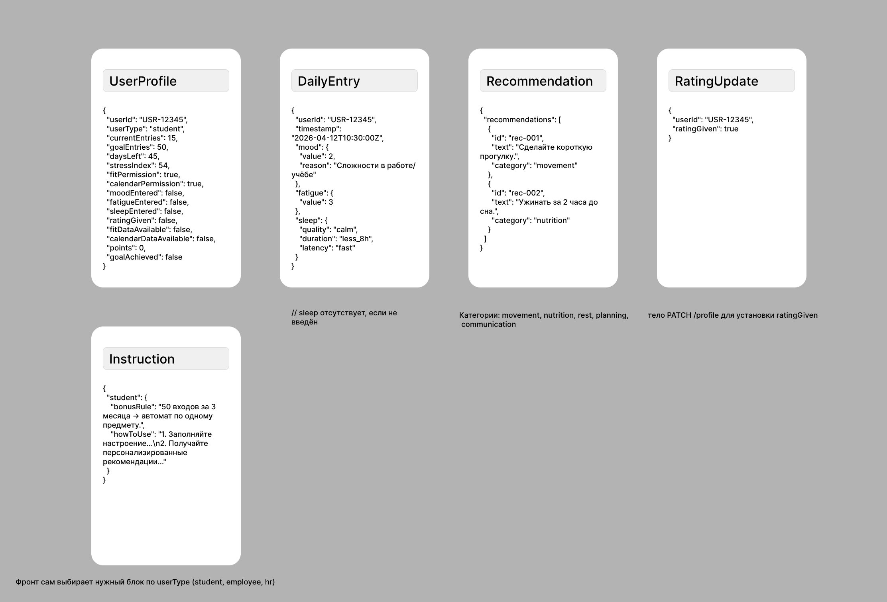

## Сущности и их атрибуты (основной пользовательский процесс)



[JSON моделей и сущностей.svg](https://buildin.ai/preview/2f274a2a-09ed-4fe1-b952-acb535dd49d5)

### Дополнительная информация для сущности UserProfile:

### Структура запроса (Request Body)

```json
{
  "userId": "string",
  "timestamp": "2025-04-14T10:30:00Z",
  "mood": {
    "value": 2,
    "reason": "Сложности в работе/учёбе"
  },
  "fatigue": {
    "value": 3
  },
  "sleep": {
    "quality": "calm",
    "duration": "less_8h",
    "latency": "fast"
  },
  "calendarEvents": [
    {
      "startTime": "2025-04-14T09:00:00Z",
      "endTime": "2025-04-14T10:00:00Z",
      "durationMinutes": 60
    }
  ],
  "fitnessData": {
    "heartRateAvg": 72,
    "steps": 5000,
    "sleepHours": 7.2
  }
}
```

> _Примечание: Поля `calendarEvents` и `fitnessData` могут отсутствовать, если интеграции не доступны._

### Пример запроса, когда обе интеграции недоступны (в сущностях и атрибутах использован этот вариант):

```json
{
  "userId": "USR-12345",
  "timestamp": "2025-04-14T10:30:00Z",
  "mood": { "value": 2, "reason": "Сложности" },
  "fatigue": { "value": 3 },
  "sleep": { "quality": "calm", "duration": "less_8h", "latency": "fast" }
  // поля calendarEvents и fitnessData отсутствуют
}
```
## Источники данных

| Сущность | Источник данных (endpoint) | Метод | Параметры | Модель (тело запроса/ответа) |
|---|---|---|---|---|
| Главный экран `UserProfile` (получение) | `/api/profile/{userId}` | `GET` | `userId` (path) | `UserProfile` (ответ) |
| Обновлённый главный экран `UserProfile` (обновление `ratingGiven`) | `/api/profile/{userId}` | `PATCH` | `userId` (path) | тело: `{ "ratingGiven": true }`; ответ: `UserProfile` |
| Дневная запись `DailyEntryRequest` (отправка данных) | `/api/daily-entry` | `POST` | – | тело: `DailyEntryRequest` |
| Рекомендации на день `Recommendation` (список) | `/api/daily-entry` | `POST` | – | ответ: `{ "userProfile": UserProfile, "recommendations": Recommendation[] }` |
| Инструкция `Instruction` | `/api/instruction?userType={userType}` | `GET` | `userType` (query, enum) | ответ: `Instruction` |

### Пояснения

- `UserProfile` – содержит все переменные процесса (см. OpenAPI)
- `DailyEntryRequest`:
    - передаёт субъективные данные (настроение, усталость, сон) и не содержит флагов (бэкенд сам выставляет `moodEntered`, `fatigueEntered`, `sleepEntered` при получении данных).
    - это сущность запроса (не хранится на бэкенде как отдельная таблица, но передаётся от фронта). В таблице она указана как источник данных, потому что фронт отправляет её на бэкенд.
- `Recommendation`– возвращается в ответе на POST /daily-entryи кэшируется на фронте по дате.
- `Instruction`– статична для каждого типа пользователя, может кэшироваться навсегда.

### Соответствие требованиям

- **Enum** – присутствует в `userType` (`student` / `employee`) в OpenAPI.
- **Array** `recommendations` (массив объектов) в ответе на `POST /daily-entry`.
- **Вложенный object** – `mood`, `fatigue`, `sleep` внутри `DailyEntryRequest`.

## Спецификация в формате OpenAPI


```yaml
openapi: 3.0.0
info:
  title: StressGuard API
  version: 1.0.0
  description: |
    API для мобильного приложения StressGuard – трекера стресса и мотивации.

    **Обоснование выбора максимизированных моделей (вместо allOf/oneOf):**
    В спецификации использованы максимизированные модели (все поля перечислены явно), а не полиморфные конструкции allOf/oneOf. Причины:
    1. Все сущности (UserProfile, DailyEntryRequest, Recommendation, Instruction) имеют фиксированный набор полей, не предполагают вариантов или наследования.
    2. Поле sleep в DailyEntryRequest опционально, что решается через required: false без необходимости вводить oneOf.
    3. Максимизированные модели проще для чтения и генерации клиентского кода, что важно для учебного проекта.
    4. Отсутствуют общие поля, которые требовали бы композиции через allOf.
    Выбор соответствует принципу KISS и уровню зрелости 2 (Richardson).

servers:
  - url: https://api.stressguard.com/v1
    description: Production server

security:
  - apiKeyAuth: []

components:
  securitySchemes:
    apiKeyAuth:
      type: apiKey
      in: header
      name: X-API-Key
      description: |
        API ключ для аутентификации. В учебном проекте используется статический ключ.
        Обоснование: для MVP достаточно простой аутентификации, не требуется OAuth2 или JWT.

  parameters:
    userIdParam:
      name: userId
      in: path
      required: true
      schema:
        type: string
      description: Уникальный идентификатор пользователя
    userTypeQuery:
      name: userType
      in: query
      required: true
      schema:
        type: string
        enum: [student, employee]
      description: Тип пользователя для получения инструкции

  schemas:
    UserProfile:
      type: object
      description: Профиль пользователя – все переменные процесса
      properties:
        userId:
          type: string
        userType:
          type: string
          enum: [student, employee]
        currentEntries:
          type: integer
          description: Количество засчитанных входов в текущем периоде
        goalEntries:
          type: integer
          description: Целевое количество входов (50 для студента, 80 для сотрудника)
        daysLeft:
          type: integer
          description: Оставшихся дней до окончания периода
        stressIndex:
          type: integer
          minimum: 0
          maximum: 100
          description: Текущий стресс-индекс
        fitPermission:
          type: boolean
        calendarPermission:
          type: boolean
        moodEntered:
          type: boolean
        fatigueEntered:
          type: boolean
        sleepEntered:
          type: boolean
        ratingGiven:
          type: boolean
        fitDataAvailable:
          type: boolean
        calendarDataAvailable:
          type: boolean
        points:
          type: integer
        goalAchieved:
          type: boolean

    DailyEntryRequest:
      type: object
      description: Запрос на создание дневной записи. Флаги ввода не передаются, бэкенд выставляет их по факту наличия полей.
      required:
        - userId
        - timestamp
        - mood
        - fatigue
      properties:
        userId:
          type: string
        timestamp:
          type: string
          format: date-time
        mood:
          type: object
          properties:
            value:
              type: integer
              minimum: 1
              maximum: 5
            reason:
              type: string
              description: Причина, если value <= 2
        fatigue:
          type: object
          properties:
            value:
              type: integer
              minimum: 1
              maximum: 5
        sleep:
          type: object
          description: Опционально – может отсутствовать, если пользователь не заполнил сон
          properties:
            quality:
              type: string
              enum: [calm, restless]
            duration:
              type: string
              enum: [less_8h, 8h, more_8h]
            latency:
              type: string
              enum: [fast, slow]

    Recommendation:
      type: object
      properties:
        id:
          type: string
        text:
          type: string
        category:
          type: string
          enum: [movement, breathing, rest, planning, communication]

    Instruction:
      type: object
      description: Инструкция для разных типов пользователей
      properties:
        student:
          type: object
          properties:
            bonusRule:
              type: string
            howToUse:
              type: string
        employee:
          type: object
          properties:
            bonusRule:
              type: string
            howToUse:
              type: string

paths:
  /profile/{userId}:
    get:
      summary: Получить профиль пользователя
      parameters:
        - $ref: '#/components/parameters/userIdParam'
      responses:
        '200':
          description: Успешно
          content:
            application/json:
              schema:
                $ref: '#/components/schemas/UserProfile'
        '404':
          description: Пользователь не найден
    patch:
      summary: Обновить профиль (установить ratingGiven)
      parameters:
        - $ref: '#/components/parameters/userIdParam'
      requestBody:
        required: true
        content:
          application/json:
            schema:
              type: object
              properties:
                ratingGiven:
                  type: boolean
              required:
                - ratingGiven
      responses:
        '200':
          description: Обновлённый профиль
          content:
            application/json:
              schema:
                $ref: '#/components/schemas/UserProfile'
        '404':
          description: Пользователь не найден

  /daily-entry:
    post:
      summary: Отправить дневную запись (настроение, усталость, сон)
      requestBody:
        required: true
        content:
          application/json:
            schema:
              $ref: '#/components/schemas/DailyEntryRequest'
      responses:
        '200':
          description: Успешно, возвращает обновлённый профиль и рекомендации
          content:
            application/json:
              schema:
                type: object
                properties:
                  userProfile:
                    $ref: '#/components/schemas/UserProfile'
                  recommendations:
                    type: array
                    items:
                      $ref: '#/components/schemas/Recommendation'
        '409':
          description: Конфликт – запись за сегодня уже существует
          content:
            application/json:
              schema:
                type: object
                properties:
                  error:
                    type: string
                    example: "Daily entry already exists for today"

  /instruction:
    get:
      summary: Получить инструкцию для пользователя
      parameters:
        - $ref: '#/components/parameters/userTypeQuery'
      responses:
        '200':
          description: Успешно
          content:
            application/json:
              schema:
                $ref: '#/components/schemas/Instruction'

