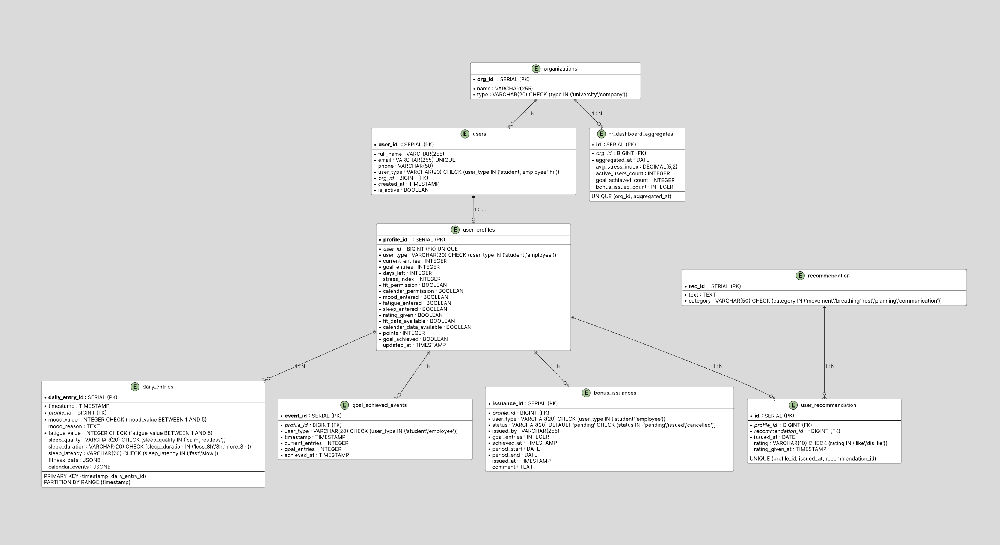

### Денормализация в модели StressGuard (таблица user_profiles)

- В таблице `users` хранится `user_type` (student/employee/hr).
- В таблице `user_profiles` также хранится поле `user_type` (только для student/employee, для hr записей нет).

> **NFR, обосновывающее денормализацию:**  
> Поле `user_type` дублировано из таблицы `users`, что позволяет при каждом запросе профиля (GET /profile) не выполнять JOIN с таблицей `users`. Это критично для производительности при высокой частоте чтения (десятки тысяч запросов в день). Поскольку `user_type` не меняется после регистрации, риск рассинхронизации минимален; целостность поддерживается на уровне приложения (при создании профиля значение копируется из `users`).

---

### P1 – Разделение горячих данных (отсутствует)

В StressGuard **нет** сущности, которая обновляется с высокой частотой (тысячи раз в секунду). Частота обновлений планируется не более 2–3 раз в день на пользователя, что при 100 000 DAU даёт ~300 000 обновлений в день (~3–4 в секунду в пик). Это не создаёт конкуренции за строки. Следовательно, **P1 не требуется**.

---

### P2 – Агрегированная таблица для HR-дашборда

**NFR:**
- HR-дашборд запрашивает агрегированную статистику по организации (средний стресс, активные пользователи, достигшие цели).
- При 100 000 пользователей и 1 000 организаций агрегация в реальном времени может быть затратной.
- Допустимая погрешность – 1 час (отчёт может быть не мгновенным).

**Решение:**  
Создать материализованное представление (или отдельную таблицу – заполняется через ETL-процесс (например, каждую ночь)) `hr_dashboard_aggregates`, которое обновляется по расписанию (например, каждый час или раз в день). Это снижает нагрузку на операционные таблицы. Структура:

```sql
CREATE TABLE hr_dashboard_aggregates (
    id SERIAL PRIMARY KEY,
    org_id UUID NOT NULL REFERENCES organizations(org_id),
    aggregated_at DATE NOT NULL,
    avg_stress_index DECIMAL(5,2),
    active_users_count INTEGER,
    goal_achieved_count INTEGER,
    bonus_issued_count INTEGER,
    UNIQUE(org_id, aggregated_at)
);
```

Индекс по `org_id` и `aggregated_at` – составной ключ для быстрых запросов.

### P3 – Архивация старых данных для daily_entries и user_recommendations

**NFR:**
- Данные старше 2 лет редко используются в оперативных запросах, но занимают место и замедляют `VACUUM`.

**Решение:**
Переносить записи старше N лет в архивные таблицы (с той же структурой, без внешних ключей или с ослабленными ограничениями). Например, раз в месяц перемещать партиции, соответствующие прошлым годам, в отдельную схему `archive`. Для `daily_entries` можно использовать открепление партиции и последующее её перемещение.

---

### P4 – Индексы (стандартные)

- `daily_entries(profile_id, timestamp)` – для быстрого получения записей пользователя за период.
- `user_recommendation(profile_id, issued_at)` – для истории.
- `users(org_id, user_type)` – для фильтрации пользователей организации.
- `user_profiles(user_id)` – уже уникальный индекс по FK.
- `goal_achieved_events(profile_id, achieved_at)` – для отчётов.
- `bonus_issuances(profile_id, status)` – для поиска невыданных бонусов.
- `user_recommendation(rating)` – для фильтрации по оценке.

---

### P5 – Партиционирование таблицы daily_entries по дате

**NFR:**
- Ожидаемый объём: до 100 000 пользователей × 365 записей/год = 36,5 млн записей в год.
- Запросы аналитики часто фильтруют по дате (например, «за последнюю неделю»).
- Без партиционирования индексы на `timestamp` будут расти, и удаление старых данных (чистка) станет дорогим (DELETE + VACUUM).

**Решение:**
Партиционировать таблицу `daily_entries` по диапазону `timestamp` (например, по месяцам). Использовать декларативное партиционирование PostgreSQL (диапазонное).

```sql
-- Таблица с партиционированием по диапазону timestamp (по месяцам)
CREATE TABLE daily_entries (
    daily_entry_id UUID DEFAULT gen_random_uuid(),
    profile_id UUID NOT NULL,
    timestamp TIMESTAMP NOT NULL,
    mood_value INTEGER NOT NULL CHECK (mood_value BETWEEN 1 AND 5),
    mood_reason TEXT,
    fatigue_value INTEGER NOT NULL CHECK (fatigue_value BETWEEN 1 AND 5),
    sleep_quality VARCHAR(20) CHECK (sleep_quality IN ('calm', 'restless')),
    sleep_duration VARCHAR(20) CHECK (sleep_duration IN ('less_8h', '8h', 'more_8h')),
    sleep_latency VARCHAR(20) CHECK (sleep_latency IN ('fast', 'slow')),
    fitness_data JSONB,
    calendar_events JSONB,
    PRIMARY KEY (timestamp, daily_entry_id),
    FOREIGN KEY (profile_id) REFERENCES user_profiles(profile_id)
) PARTITION BY RANGE (timestamp);

-- Индексы (автоматически создаются на всех партициях)
CREATE INDEX idx_daily_entries_profile_id ON daily_entries (profile_id);
CREATE INDEX idx_daily_entries_profile_timestamp ON daily_entries (profile_id, timestamp);

-- Создание партиции на месяц (январь 2025)
CREATE TABLE daily_entries_2025_01 PARTITION OF daily_entries
    FOR VALUES FROM ('2025-01-01') TO ('2025-02-01');

-- Для автоматизации можно использовать скрипт, создающий партиции наперёд
```

Создание партиций помесячно ускорит запросы за период и упростит удаление старых данных (можно открепить/удалить целую партицию).

### P5 – Партиционирование таблиц user_recommendation

**NFR:**
- За год может накопиться ~100 000 пользователей × 365 дней = 36,5 млн записей.
- Запросы аналитики часто фильтруют по дате (`issued_at`) и по `rating = 'like'`. Для оценки эффективности конкретных рекомендаций выполняются JOIN с дочерней таблицей и группировки по `recommendation_id`.

**Решение:**
- **Партиционирование `user_recommendation` по диапазону `issued_at`** (например, помесячно). Это ускорит запросы, ограниченные временным интервалом, и упростит удаление/архивацию старых данных.

```sql
-- Схема для партиционирования (по месяцам, начиная с 2025-01-01)

-- 1. Родительская таблица (оценка за день)
CREATE TABLE user_recommendation (
    id UUID DEFAULT gen_random_uuid(),
    profile_id UUID NOT NULL,
    issued_at DATE NOT NULL,
    rating VARCHAR(10) CHECK (rating IN ('like', 'dislike')),
    rating_given_at TIMESTAMP,
    PRIMARY KEY (issued_at, id),   -- ключ партиционирования
    FOREIGN KEY (profile_id) REFERENCES user_profiles(profile_id)
) PARTITION BY RANGE (issued_at);

-- Индексы (автоматически создаются на каждой партиции)
CREATE INDEX idx_urec_profile_issued ON user_recommendation (profile_id, issued_at);
CREATE INDEX idx_urec_rating ON user_recommendation (rating);

-- Создание партиций на месяц (январь 2025)
CREATE TABLE user_recommendation_2025_01 PARTITION OF user_recommendation
    FOR VALUES FROM ('2025-01-01') TO ('2025-02-01');

-- Для автоматизации можно использовать скрипт, создающий партиции наперёд.
```

## Physical Data Model



[Physical Data Model.svg](https://buildin.ai/preview/19885c92-ce00-400f-845d-c1cefd0e9615)